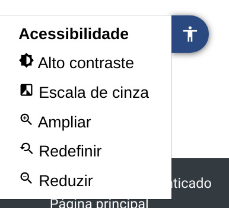
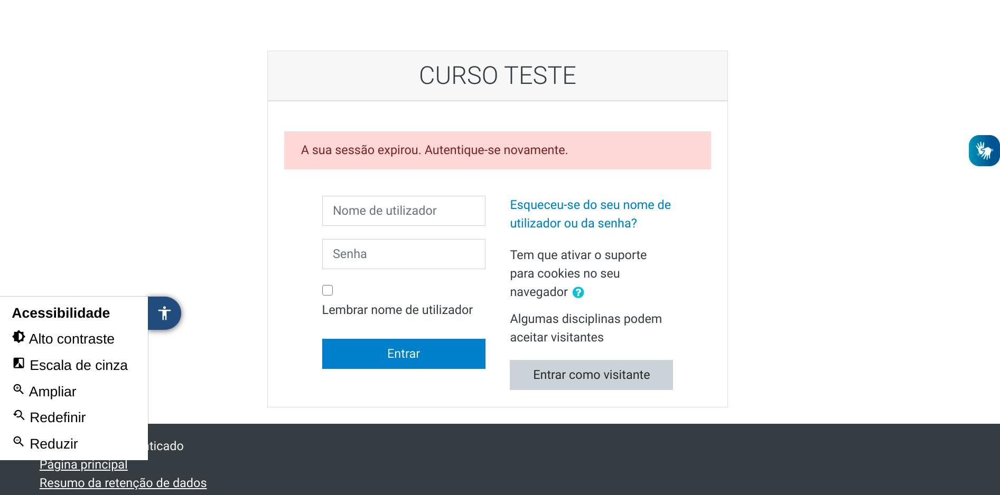
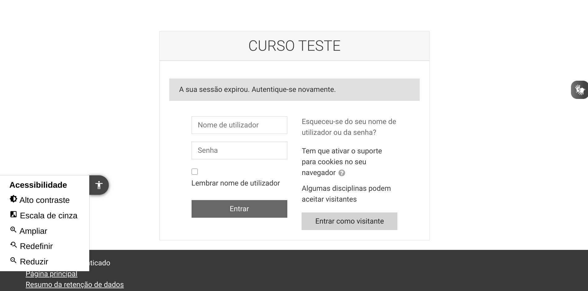
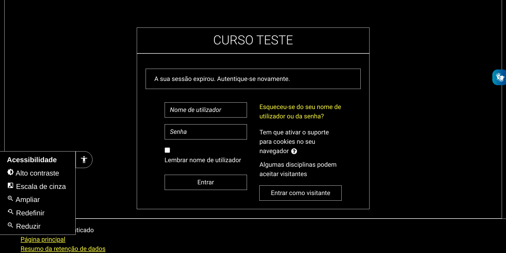
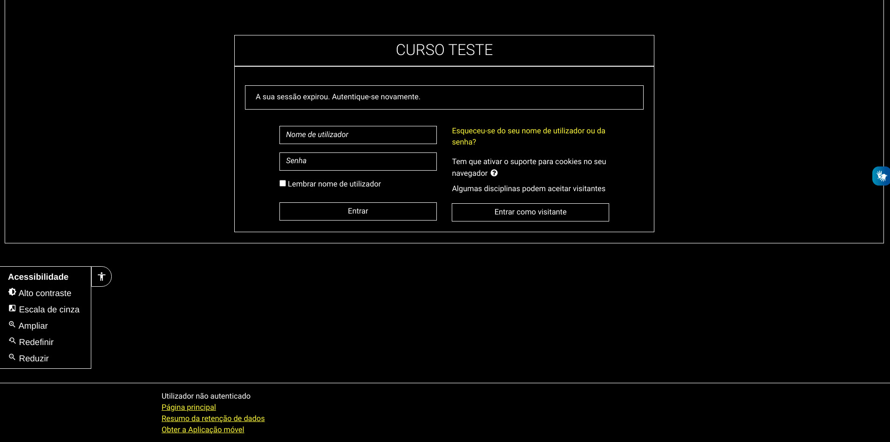
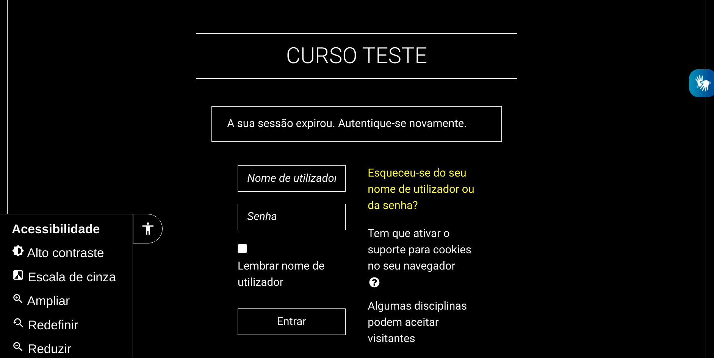

# Acessibilidade para Moodle
Este repositório contém implementações de soluções para pessoas com deficiência para o uso da plataforma _Moodle_. Atualmente os testes são conduzidos na versão 3.7 com o tema `boost`, mas provavelmente pode ser implementado da mesma maneira em versões posteriores e antecessoras.

## O que está disponível?
* **Barra de acessibilidade**

Uma ferramenta que contém as funções de alto contraste, filtro em escala de cinza e ampliação para pessoas com deficiências visuais.

### **Barra de acessibilidade**

### **Filtro preto e branco**

### **Filtro alto contraste**

### **Ampliação negativa com alto contraste**

### **Ampliação positiva com alto contraste**

## Como instalar os recursos?
Siga as instruções do arquivo de instalação com nome `INSTALAÇÃO.txt`. Nele também está contido os passos para adicionar o VLibras no seu _Moodle_.

**Nota: Desenvolvido para o idioma português do Brasil.**